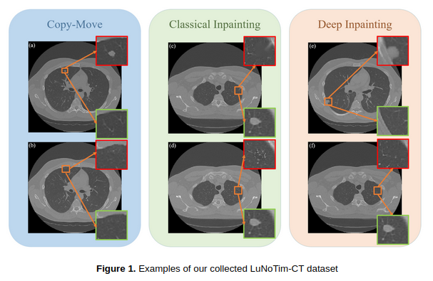
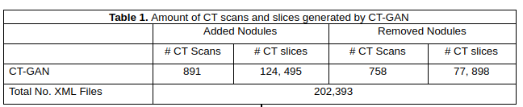
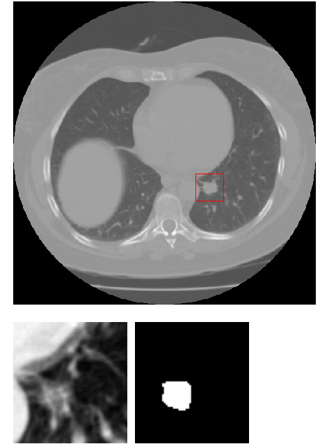
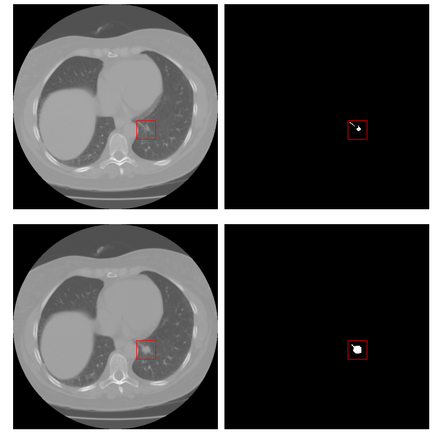
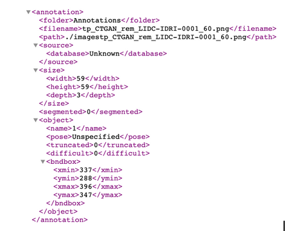
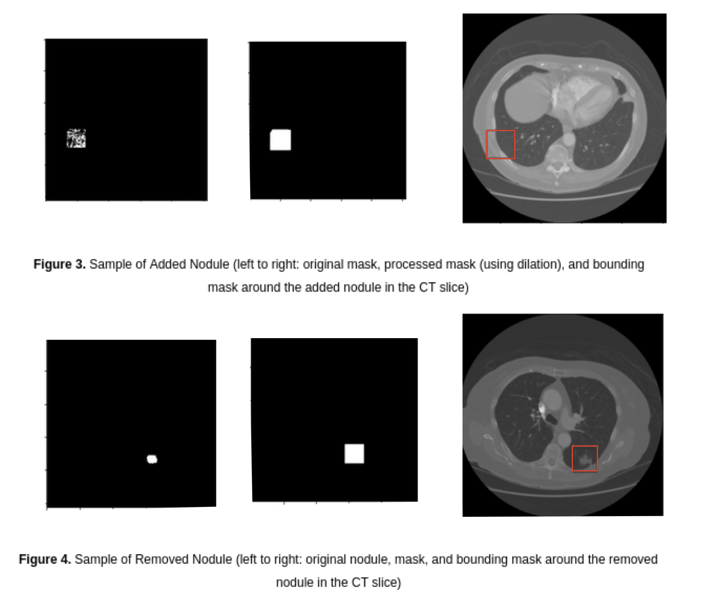

# Computer Vision I - Project

All deliverables (codes, reports) for CVI Semester Project - Fall 2021

Priscila Moreira (pmoreira@nd.edu) and Mahsa Mitcheff (mmitchef@nd.edu)

_________________________________________________________________________

# Report 2: Data preprocessing

## Project: Medical Image Forgery  Detection
  
Task: Distinguishing between tempered and pristine nodules.   

On that stage of the project, we basicaly had to focus on data aquisition due to the lack of samples to train deep CNNs.
The idea was to detect whether images of lung cancer screening thoracic were tampered or not. 
A very interesting method to make good tamperd images in that fiel is the CTGAN model.
However the authors did not provide the model weights and the traning of that process would take long time.

A recently work have provide a huge dataset of tamperd images of lung screening thoracic, where they have applied three different tampering methods:  *copy-move*,
*classical inpainting*, *and deep inpainting*. For the last one, they used the CTGAN for removing and adding nodules from/to the original CT scans in the original LIDC-IDRI dataset[1].
The LuNoTim-CT dataset contains 7, 202 total tampered lung CT scans (512*512) with 356,217 slices by different tampering methods (Figure 1).
  

                        
Deep inpainting method is based on the CT-GAN algorithm. In total, 891 CT scans are used to add nodules which include 124, 495 slices and 
758 CT scans were used to add nodules which include 77, 898 slices (Table 1).

For each tampered slice, only one tampering method is used at once while the same CT scan can be tampered by different tampering methods at different times. 
On average about 50 slices are tampered per CT scan
Forged nodules are generated in three ways:

* Removing the existing nodules;
* Randomly adding nodules;
* Randomly moving normal tissue to different areas of the CT slice.

Considering the task of to detect and classify the nodule between tampered or pristine, we need also to have images containing nodules that were not tampered.
For aquisition of the pristine data we have worked with CT scans in the original LIDC-IDRI dataset[1]. 

It is essential to notice that, work with that data is not straightforward.
The CTs are volumetric data and their values are DICOM formated.
Also in this dataset are annotations/segmentations included in XML version.

The team in [1] provides an API call pylidc[5], which is an Object-relational mapping (using SQLAlchemy) for the data provided in the LIDC dataset. 
This means that the data can be queried in SQL-like fashion, and that the data are also objects that add additional functionality via functions 
that act on instances of data obtained by querying for particular attributes.
Thus, we also have learned how to manage these libraries to get useful data from the LIDC dataset.   
  
  
## Methods for Classifying of Nodules
We are going to apply single shot multi-box (SSD) and an specific deep learning approch for image manipuation detection (RGBN[4]) in order to locate the nodules and identify their type (pristine or tampered)

### Single Shot MultiBox (SSD) Detection
SSD is a deep learning technique for detecting objects using a bounding box. We choose this model because it not only is easy 
to implement but also it is fast and has been known as one of the most efficient objective detection algorithms for natural images. 

## Data Preparation 
The LuNoTim dataset only contains tampered data and some masks for pristine CT scans in the LIDC dataset.

### Pristine images  
For pristine images, we decided to use only CT scan slices which present nodules that are classified as cancer by the specialists.
  

As the nodule can appear in the slices around the slices labeled having nodules, we take more than one slice for the same nodule as different samples.
See Figure bellow.   
 
  

### Tampered images
Tampered CT slices contain 3 files: 
* 1) CT slice in dicom format, 
* 2) CT slice in NumPy array, 
* 3) mask of tampered area in NumPy array.
  
Both SSD and RGBN need specific data input formats.
For the SSD algorithm, we need to feed the input data in XML format which contains slice name, width, height, 
class (tampered/pristine), xmin, xmax, ymin, ymin.  
Figure 2 shows a sample of generated XML file for a tampered CT slice in which the nodule has been removed. 
The SSD algorithm needs one XML file for each of the tampered and pristine slices. 
In total, for tampered nodules we generated 202,393 XML files and for pristine nodules we could select 3,573 samples.
  

 
Nodule masks provided for added nodules in LuNOTIM-CT include some artifacts around the tampered area. 
Therefore, to prepare the input data for the SSD model we applied a morphological operator(dilation) 
to create a solid mask and then extracted the ‘bbox’ property. Figure 3 shows an example of an added nodule 
mask before and after applying a morphological operator along with a bounding box around it in the CT slice. 
For removed nodules, a perfect mask was provided inside of the dataset, so we only extracted the ‘bbox’ property. 
Figure 4 shows an example of a removed nodule, its mask along with a bounding box around it in the CT slice.

    

  
### References
[1] Mirsky, Y., Mahler, T., Shelef, I., & Elovici, Y. (2019). CT-GAN: Malicious tampering of 3D medical imagery using deep learning. In 28th {USENIX} Security Symposium ({USENIX} Security 19) (pp. 461-478).

[2] https://www.kaggle.com/ymirsky/medical-deepfakes-lung-cancer

[3] Reichman, B., Jing, L., Akin, O., & Tian, Y. (2020, December). Medical Image Tampering Detection: A New Dataset and Baseline. In International Workshop on Artificial Intelligence for Healthcare Applications (AIHA), 2020.

[4] Zhou, Peng and Han, Xintong and Morariu, Vlad I and Davis, Larry S. Learning Rich Features for Image Manipulation Detection. CVPR 2018.

[5] pylidc. https://pylidc.github.io/
  
